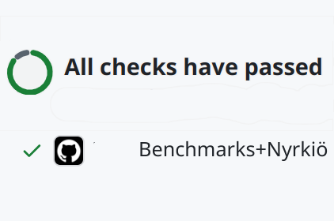

[![Action Marketplace][release-badge]][marketplace]
[![Build Status][build-badge]][ci]
[![codecov][codecov-badge]][codecov]


[![nyrkio-logo]][product]   / Change Detection
===============================================

[This repository][proj] provides a [GitHub Action][github-action] for integrating Nyrkiö Change
Detection with your Continuous Benchmarking Results.




## How to use

This action takes a file that contains benchmark output. The benchmark results are parsed into
a common JSON format, which is then sent to nyrkio.com for analysis. All the main benchmarking
frameworks are supported.

### Minimal setup

Let's start with a minimal workflow setup. For explanation, here let's say we have a Go project. But basic
setup is the same when you use other languages. For language-specific setup, please read the later section.

Note: You need to [create an account at nyrkio.com][nyrkio-getting-started] to get the NYRKIO_JWT_TOKEN
that is used below. To receive alerts from Nyrkiö as pull request comments or GitHub issues, the
recommended way to create your account is to [install Nyrkiö as a GitHub app][nyrkio-install-app].

```yaml
name: Minimal setup
on:
  push:
    branches:
      - master
  pull_request:
    branches:
      - master

jobs:
  benchmark:
    name: Performance regression check
    runs-on: ubuntu-latest
    steps:
      - uses: actions/checkout@v4
      - uses: actions/setup-go@v4
        with:
          go-version: "stable"
      # Run benchmark with `go test -bench` and stores the output to a file
      - name: Run benchmark
        run: go test -bench 'BenchmarkFib' | tee output.txt

      - name: Analyze benchmark results with Nyrkiö
        uses: nyrkio/change-detection@v2
        with:
          tool: 'go'
          output-file-path: output.txt
          # Pick up your token at https://nyrkio.com/docs/getting-started
          # Then head to https://github.com/USER_OR_ORG/PROJECT/settings/secrets/actions
          # Store the token you just created as a Repository secret. We'll use the variable name `NYRKIO_JWT_TOKEN` for it below.
          nyrkio-token: ${{ secrets.NYRKIO_JWT_TOKEN }}
```

The step which runs `nyrkio/change-detection` does followings:

1. Extract benchmark result from the output in `output.txt`
2. Transform the benchmark results into a common JSON format
3. Send the new result(s) to Nyrkiö API for analysis
4. If a change is detected, either immediately or after a few days, you can receive alerts by slack,
   email, and github issues.

## Live demo


A live workflow example is [here](.github/workflows/time.yml). And the output of the workflow can
be seen [here][time-workflow-example] and finally [the graphs on Nyrkiö here][time-workflow-graphs].

![nyrkio-footer-graph]


About Nyrkiö
-------------

If you've managed to automate and run some benchmarks routinely as part of your GitHub Action
pipelines, you may have noticed it is not easy to spot performance regressions (nor improvements)
in all those benchmark results your GitHub Action workflows now produce! Nyrkiö was developed to
help with this last bit. We will analyze your history of benchmark results, and alert you if we
find any regressions. (Or improvements, for that matter!)

Automating the analysis of continuous benchmarking results is a surprisingly difficult task. Many
benchmarks have a range of variation - random noise - anywhere from 5 % to 20 %. Nyrkiö uses a state
of the art *change detection* algorithm to find statistically significant, persistent changes, in
noisy benchmarking results. It adapts automatically to the noise level in your benchmarks, thus
avoiding false positive alerts. By analyzing the entire history of results, it can detect even
very small regressions, in particular, changes smaller than your range of random noise!

You can [read more about how Nyrkiö works here][product].


Supported Benchmarking Frameworks
----------------------------------

This GitHub Action supports the commonly used benchmarking frameworks of all major programming
languages. In addition we support some generic options such as the `time` utility, a custom
JSON format, and Nyrkiö's own JSON format in pass-thru mode:


- [`cargo bench`][cargo-bench] for Rust projects
- `go test -bench` for Go projects
- [benchmark.js][benchmarkjs] for JavaScript/TypeScript projects
- [pytest-benchmark][] for Python projects with [pytest][]
- [Google Benchmark Framework][google-benchmark] for C++ projects
- [Catch2][catch2] for C++ projects
- [BenchmarkTools.jl][] for Julia packages
- [Benchmark.Net][benchmarkdotnet] for .Net projects
- [benchmarkluau](https://github.com/Roblox/luau/tree/master/bench) for Luau projects
- [JMH][jmh] for Java projects
- [time][time] Unix utility to measure execution time of any program
- Custom benchmarks where either 'biggerIsBetter' or 'smallerIsBetter'
- [Nyrkios own JSON][nyrkio-json]
  format, which is simply passed directly to Nyrkiö API.

Multiple languages in the same repository are supported for polyglot projects.

We wish to thank the open source community for this incredible feat of integration!
Nyrkiö Change Detection GitHub Action is based on 6 years of work over at the
["GitHub Action Benchmark"][upstream-proj]. Nyrkiö will be upstreaming patches like a
good open source citizen, whenever we add functionality for our own customers. (Starting with
the `time` command support.)


## Examples

Example projects for each language are in [examples/](./examples) directory. Live example workflow
definitions are in [.github/workflows/](./.github/workflows) directory. Live workflows are:

| Language     | Workflow                                                                                | Example Project                                |
|--------------|-----------------------------------------------------------------------------------------|------------------------------------------------|
| Rust         | [![Rust Example Workflow][rust-badge]][rust-workflow-example]                           | [examples/rust](./examples/rust)               |
| Go           | [![Go Example Workflow][go-badge]][go-workflow-example]                                 | [examples/go](./examples/go)                   |
| JavaScript   | [![JavaScript Example Workflow][benchmarkjs-badge]][benchmarkjs-workflow-example]       | [examples/benchmarkjs](./examples/benchmarkjs) |
| Python       | [![pytest-benchmark Example Workflow][pytest-benchmark-badge]][pytest-workflow-example] | [examples/pytest](./examples/pytest)           |
| C++          | [![C++ Example Workflow][cpp-badge]][cpp-workflow-example]                              | [examples/cpp](./examples/cpp)                 |
| C++ (Catch2) | [![C++ Catch2 Example Workflow][catch2-badge]][catch2-workflow-example]                 | [examples/catch2](./examples/catch2)           |
| Julia | [![Julia Example][julia-badge]][julia-workflow-example]                 | [examples/julia](./examples/julia)           |
| .Net         | [![C# Benchmark.Net Example Workflow][benchmarkdotnet-badge]][benchmarkdotnet-workflow-example] | [examples/benchmarkdotnet](./examples/benchmarkdotnet) |
| Java         | [![Java Example Workflow][java-badge]][java-workflow-example] | [examples/java](./examples/java) |
| Luau         | Coming soon | Coming soon |

### Nyrkiö JSON format

You can also simply send your benchmark results to Nyrkiö in Nyrkiö's own JSON format.
[An example is included in the same format as above](examples/nyrkioJson).

Nyrkiö JSON is documented in the [main Nyrkiö documentation][nyrkio-getting-started].

### Generic JSON format

This JSON format created and supported by the github-action-benchmark team.

Additionally, even though there is no explicit example for them, you can use
`customBiggerIsBetter` and `customSmallerIsBetter` to use this
action and create your own graphs from your own benchmark data. The name in
these tools define which direction "is better" for your benchmarks.

For more details, please consult the [LEGACY_README](LEGACY_README.md)


## Other features

### Pull request comment

Nyrkiö can [comment on your PR][alert-comment-example]. when benchmark
results changed too much compared to the main branch. For this to work you need
to install Nyrkiö as a github app into your org.
This allows Nyrkiö to send comments on your pull requests and file github issues.
Please click on https://github.com/apps/nyrkio/installations/new and proceed to install
Nyrkiö if you didn't already.

```yaml
- name: Analyze benchmark results with Nyrkiö
  uses: nyrkio/change-detection@v2
  with:
    tool: 'go'
    output-file-path: output.txt
    # Comment on the pull request if there were changes in the benchmark results, but do not hard fail
    comment-on-alert: true
    fail-on-alert: false
    nyrkio-token: ${{ secrets.NYRKIO_JWT_TOKEN }}
```

Now, instead of making workflow fail, the step leaves a comment on the PR when it detects performance
regression [like this][alert-comment-example].


### Tool specific setup

Please read `README.md` files at each example directory. Usually, take stdout from a benchmark tool
and store it to file. Then specify the file path to `output-file-path` input.

- [`cargo bench` for Rust projects](./examples/rust/README.md)
- [`go test` for Go projects](./examples/go/README.md)
- [Benchmark.js for JavaScript/TypeScript projects](./examples/benchmarkjs/README.md)
- [pytest-benchmark for Python projects with pytest](./examples/pytest/README.md)
- [Google Benchmark Framework for C++ projects](./examples/cpp/README.md)
- [catch2 for C++ projects](./examples/cpp/README.md)
- [BenchmarkTools.jl for Julia projects](./examples/julia/README.md)
- [Benchmark.Net for .Net projects](./examples/benchmarkdotnet/README.md)
- [benchmarkluau for Luau projects](#) - Examples for this are still a work in progress.

These examples are run in workflows of this repository as described in the 'Examples' section above.


### Action inputs

Input definitions are written in [action.yml](./action.yml).

#### `name` (Required)

- Type: String
- Default: `"Benchmark"`

Name of the benchmark. This value must be identical across all benchmarks in your repository.

#### `tool` (Required)

- Type: String
- Default: N/A

Tool for running benchmark. The value must be one of `"cargo"`, `"go"`, `"benchmarkjs"`, `"pytest"`,
`"googlecpp"`, `"catch2"`, `"julia"`, `"jmh"`, `"benchmarkdotnet"`,`"benchmarkluau"`, `"customBiggerIsBetter"`, `"customSmallerIsBetter"`.

#### `output-file-path` (Required)

- Type: String
- Default: N/A

Path to a file which contains the output from benchmark tool. The path can be relative to repository root.
Note: When using `tool: nyrkioJson` format, this parameter should instead be a directory with JSON files.


#### `github-token` (Optional)

- Type: String
- Default: N/A

GitHub API access token. Can be used to get meta-data about your pull request or commit.

#### `comment-always` (Optional)

- Type: Boolean
- Default: `false`

If it is set to `true`, this action will leave a pull request comment both if there was a regression
and if there wasn't.

#### `comment-on-alert` (Optional)

- Type: Boolean
- Default: `false`

If it is set to `true`, this action will leave a comment on your pull request
when an alert happens [like this][alert-comment-example].

Note: Currently with Nyrkiö this is synonymous with `comment-always`


#### `fail-on-alert` (Optional)

- Type: Boolean
- Default: `false`

If it is set to `true`, the workflow will fail when an alert happens. Note that because Nyrkiö also
alerts on positive changes (such as fixing a regression), then setting this to true together
with using strict branch protection in GitHub may not be that practical.


### Nyrkiö specific configuration

#### nyrkio-token (Required when using Nyrkiö)

- Type: String
- Default: nullS

A JWT token from your nyrkio.com settings page: https://nyrkio.com/docs/getting-started

#### nyrkio-public (Recommended)


- Type: Boolean
- Default: `false`

Publish these benchmark results at nyrkio.com/public. (Recommended for open source projects.)


####  nyrkio-org


- Type: String
- Default: ""

The name of a github org where you have installed Nyrkiö. See https://nyrkio.com/user/settings#nyrkio-settings-userinfo


####  nyrkio-settings-pvalue


- Type: Number
- Default: 0.001


The p-value used to determine if a change in benchmark results is statistically significant. Example: 0.01 (If specified, will be applied to all your nyrkio.com test results.)


####  nyrkio-settings-threshold

- Type: String (percentage)
- Default: 5%

Threshold percentage below which changes will be ignored. Example: 2% (If specified, will be applied to all your nyrkio.com test results.)

####  never-fail:

- Type: Boolean
- Default: `false`


Don't fail the workflow, ever. Not even if the action itself fails due to bugs or network or whatever.

####  nyrkio-enable

- Type: Boolean
- Default: `true`

Use Nyrkiö (web service) to store your benchmark results and to find statistically significant change points.

#### nyrkio-api-root

- Type: String (URL)
- Default: https://nyrkio.com/api/v0/


The root URL for a Nyrkiö API


The remaining parameters aren't used by Nyrkiö. We've preserved the functionality of the original
threshold based alerting system, but its use is not recommended. The related parameters are
documented in [LEGACY_README.md](LEGACY_README.md).


### Action outputs

No action output is set by this action for the parent GitHub workflow.


### Versioning

This action conforms semantic versioning 2.0.

For example, `nyrkio/change-detection@v2` means the latest version of `2.x.y`. And
`nyrkio/change-detection@v2.0.2` always uses `v2.0.2` even if a newer version is published.

`HEAD` would use the most recent commit of the development branch. This is for experimental and
development use only!


### Track updates of this action

To notice new version releases, please [watch 'release only'][help-watch-release] at [this repository][proj].
Every release will appear on your GitHub notifications page.


## License

[the MIT License](./LICENSE.txt)


[build-badge]: https://github.com/nyrkio/change-detection/actions/workflows/ci.yml/badge.svg
[ci]: https://github.com/nyrkio/change-detection/actions?query=workflow%3ACI
[codecov-badge]: https://codecov.io/gh/nyrkio/change-detection/branch/master/graph/badge.svg
[codecov]: https://app.codecov.io/gh/nyrkio/change-detection
[release-badge]: https://img.shields.io/github/v/release/nyrkio/change-detection.svg
[marketplace]: https://github.com/marketplace/actions/nyrkio-change-detection
[proj]: https://github.com/nyrkio/change-detection
[upstream-proj]: https://github.com/benchmark-action/github-action-benchmark
[product]: https://nyrkio.com/product
[nyrkio-getting-started]: https://nyrkio.com/docs/getting-started
[nyrkio-logo]: https://nyrkio.com/p/logo/full/BlackRed/NyrkioLogo_Final_Full_BlackRed-200w.png
[nyrkio-footer-graph]: https://nyrkio.com/assets/footer-white-graphic-8R7Ap4-5.png
[nyrkio-json]: https://nyrkio.com/openapi#/default/add_result_api_v0_result__test_name__post
[nyrkio-install-app]: https://github.com/apps/nyrkio/installations/new

[rust-badge]: https://github.com/nyrkio/change-detection/actions/workflows/rust.yml/badge.svg
[go-badge]: https://github.com/nyrkio/change-detection/actions/workflows/go.yml/badge.svg
[benchmarkjs-badge]: https://github.com/nyrkio/change-detection/actions/workflows/benchmarkjs.yml/badge.svg
[pytest-benchmark-badge]: https://github.com/nyrkio/change-detection/actions/workflows/pytest.yml/badge.svg
[cpp-badge]: https://github.com/nyrkio/change-detection/actions/workflows/cpp.yml/badge.svg
[catch2-badge]: https://github.com/nyrkio/change-detection/actions/workflows/catch2.yml/badge.svg
[julia-badge]: https://github.com/nyrkio/change-detection/actions/workflows/julia.yml/badge.svg
[java-badge]: https://github.com/nyrkio/change-detection/actions/workflows/java.yml/badge.svg
[benchmarkdotnet-badge]: https://github.com/nyrkio/change-detection/actions/workflows/benchmarkdotnet.yml/badge.svg

[github-action]: https://github.com/features/actions
[gh-pages]: https://pages.github.com/


[alert-comment-example]: https://github.com/nyrkio/nyrkio/pull/329#issuecomment-2795220275
[rust-workflow-example]: https://github.com/nyrkio/change-detection/actions?query=workflow%3A%22Rust+Example%22
[go-workflow-example]: https://github.com/nyrkio/change-detection/actions?query=workflow%3A%22Go+Example%22
[benchmarkjs-workflow-example]: https://github.com/nyrkio/change-detection/actions?query=workflow%3A%22Benchmark.js+Example%22
[pytest-workflow-example]: https://github.com/nyrkio/change-detection/actions?query=workflow%3A%22Python+Example+with+pytest%22
[cpp-workflow-example]: https://github.com/nyrkio/change-detection/actions?query=workflow%3A%22C%2B%2B+Example%22
[catch2-workflow-example]: https://github.com/nyrkio/change-detection/actions?query=workflow%3A%22Catch2+C%2B%2B+Example%22
[julia-workflow-example]: https://github.com/nyrkio/change-detection/actions?query=workflow%3A%22Julia+Example+with+BenchmarkTools.jl%22
[java-workflow-example]: https://github.com/nyrkio/change-detection/actions?query=workflow%3A%22JMH+Example%22
[benchmarkdotnet-workflow-example]: https://github.com/nyrkio/benchmarkdotet/actions?query=workflow%3A%22Benchmark.Net+Example%22
[minimal-workflow-example]: https://github.com/nyrkio/change-detection/actions?query=workflow%3A%22Example+for+minimal+setup%22
[time-workflow-example]: https://github.com/nyrkio/change-detection/actions/workflows/time.yml
[time-workflow-graphs]: https://nyrkio.com/public/https%3A%2F%2Fgithub.com%2Fnyrkio%2Fchange-detection/master/nyrkio/change-detection/master/time-cli-example

[help-watch-release]: https://docs.github.com/en/github/receiving-notifications-about-activity-on-github/watching-and-unwatching-releases-for-a-repository
[help-github-token]: https://docs.github.com/en/actions/security-guides/automatic-token-authentication
[job-summaries]: https://github.blog/2022-05-09-supercharging-github-actions-with-job-summaries/


[cargo-bench]: https://doc.rust-lang.org/cargo/commands/cargo-bench.html
[benchmarkjs]: https://benchmarkjs.com/
[pytest-benchmark]: https://pypi.org/project/pytest-benchmark/
[pytest]: https://pypi.org/project/pytest/
[google-benchmark]: https://github.com/google/benchmark
[catch2]: https://github.com/catchorg/Catch2
[jmh]: https://openjdk.java.net/projects/code-tools/jmh/
[lighthouse-ci-action]: https://github.com/treosh/lighthouse-ci-action
[lighthouse-ci]: https://github.com/GoogleChrome/lighthouse-ci
[BenchmarkTools.jl]: https://github.com/JuliaCI/BaseBenchmarks.jl
[benchmarkdotnet]: https://benchmarkdotnet.org
[time]: https://man7.org/linux/man-pages/man1/time.1.html


